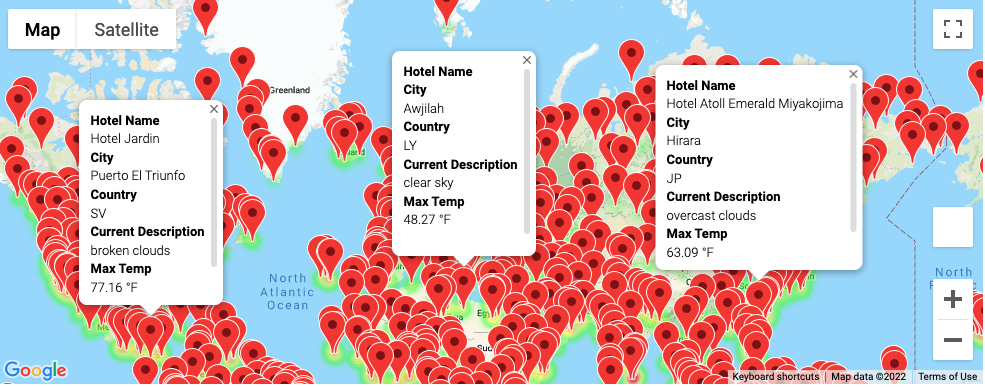
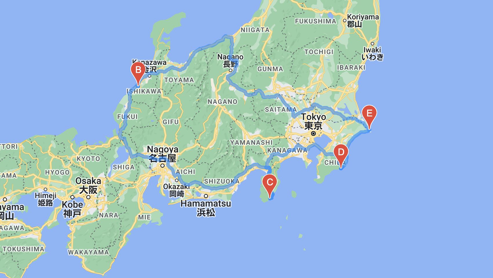

# World_Weather_Analysis
## Project Overview
In this project, we would like to build a travel app for customers using weather data of 700+ cities along with the data to recommend ideal hotels based on clients’ weather preferences. 

#### Resources
- CSV file: [WeatherPy_Database.csv](data/WeatherPy_Database.csv), [WeatherPy_vacation.csv](data/WeatherPy_vacation.csv)
- Analysis file: [Weather_Database.ipynb](Weather_Database.ipynb), [Vacation_Search.ipynb](Vacation_Search.ipynb), [Vacation_Itinerary.ipynb](Vacation_Itinerary.ipynb)

## Weather Database
We generated a random set of 2,000 latitudes and longitudes and use API call on current weather data for the nearest corresponding cities.
The follow data was retrieved from the API:

1. Latitude & Longitude
2. Maximum Temperature
3. Humidity
4. Cloudiness
5. Wind Speed
6. Current Weather Description

These different categories of information can make it easy for travelers to choose exactly what they are looking for in a travel destination.

## Vacation Search 
Based on traveler’s weather preferences, travelers can identify potential travel destinations and nearby hotels. The map shows destinations using pop-up markers on a marker layer-map.

### WeatherPy Vacation Map 

## Vacation Itinerary
Using the Google Directions API, a sample itinerary was created that shows the driving route between four cities in Japan.

